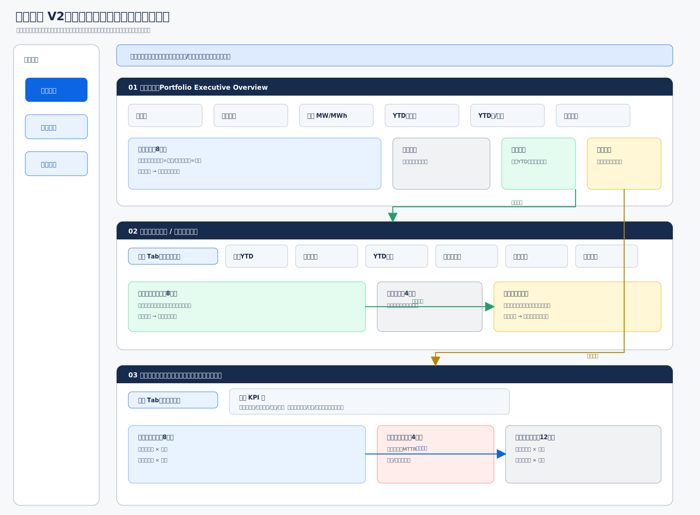

# Asset Management Dashboard

面向风电与储能资产经营管理的内部透视看板。当前 V2 聚焦清晰呈现资产组合、经营结果和运营表现，支持组合、项目和资产对象的月度比较。

## V2 架构预览

[](design/drawio/asset-dashboard-v2-navigation.drawio)

> 点击图片可查看 draw.io 可编辑源稿。图中展示页面布局、筛选继承、地图交互、经营趋势、站点排名和资产月度对比。

## V2 信息细目补充表

> 本表是 Draw.io 架构图的字段级补充，不重复页面布局。它说明各组件内部具体呈现什么、采用什么统计口径，以及哪些规则仍待确认。

| 对应组件 | 展开细目 | 页面实际呈现 | 数据口径与粒度 | 目标、比较与状态 |
|---|---|---|---|---|
| 资产总览 · 资产规模 | 风机数量、储能单站数量、风电装机容量、储能额定功率/容量 | 数量与容量分开显示，储能同时展示 MW 与 MWh，避免合并成含义不清的“总资产” | 当前筛选范围内的期末资产台账；组合、区域或项目聚合 | 显示数据截至月份及更新时间；资产投运/退役范围待与源表确认 |
| 资产总览 · 电量摘要 | 风电发电量/上网电量、储能充电量、储能放电量 | 风电与储能分别显示 YTD 值，不将发电量和充放电量相加 | 年初至所选月份累计；单位统一为 MWh，页面可按量级换算 GWh | 与截至当月累计目标比较；无目标的指标只显示实际值 |
| 资产总览 · 资产地图 | 名称、资产类型、经纬度、装机/额定功率与容量、当前状态、关键 YTD 指标 | 地图点位颜色表达资产类型或状态，大小表达容量；悬浮卡展示上述细目 | 风电默认按项目/风电场落点，储能按单站落点 | 点击点位写入资产上下文；无效坐标进入“未定位资产”清单，不丢失统计 |
| 资产总览 · 状态摘要 | 正常、关注、异常、无数据资产数量及占比 | 同时显示数量与占比，并允许查看构成 | 使用所选月份末状态快照；状态枚举来自源系统 | 状态阈值与优先级待确认；“无数据”必须与“正常”分离 |
| 资产总览 · 经营/运营摘要 | 收入、成本、毛利；电量、效率、可利用率、限电与损失 | 每项至少展示实际 YTD、累计目标和差距；运营指标按风电/储能分别陈列 | 财务按 YTD 累计，比例类运营指标按现有月度口径聚合 | 点击摘要继承筛选进入对应看板；成本差距采用反向颜色语义 |
| 经营看板 · KPI 条 | 总收入、总成本、总毛利及当前选择的经营分项 | 每个选中指标统一展示：实际 YTD、累计目标、YTD 差距、累计完成率、全年目标、全年完成进度 | 实际 YTD=1月至所选月实际之和；毛利=收入−成本 | 收入/毛利越高越好，成本越低越好；目标为 0 时完成率显示“不可计算” |
| 经营看板 · 月度与累计趋势 | 月度实际、月度目标、累计实际、累计目标 | 柱形展示月度值，折线展示累计值；图例明确“当月”和“累计” | 月度目标可由相邻累计目标相减得到；月份缺失保留空值，不默认补 0 | 点击月份后，KPI 与排名统一切换至该截至月份；同比/环比后续启用 |
| 经营看板 · 经营构成 | 收入分项、成本分项、毛利及其占比 | 展示分项金额、占比和对总差距的贡献；只使用字段表中已存在的分项 | 分项合计应与总收入/总成本对账；无法对账时标记差额 | 风电和储能共用组件，但允许采用不同分项；分项名称以现有字段表为准 |
| 经营看板 · 资产排名 | 资产名称、实际 YTD、累计目标、差距、完成率、全年目标、状态 | 支持按当前经营指标排序，并显示组合合计/平均作为参照 | 风电采用现有经营核算对象；储能采用单站；均截至所选月份 | 默认突出差距最不利资产；点击行保留年份、月份与指标进入资产详情入口 |
| 运营看板 · 风电 KPI | 发电量/上网电量、风机可利用率、限电量/率、计划损失率、非计划损失率、MTTR | 指标卡显示所选月实际值、目标值（如有）、差距和状态；单位随指标变化 | 单台风机月度为最细粒度，再向风电场、区域和组合聚合 | 点击 KPI 同步切换趋势、排名和明细；比例类聚合不得直接做简单平均 |
| 运营看板 · 风电单机比较 | 风机名称/编号、所属项目、月份、所选 KPI、目标、差距、排名、状态 | 同一指标下比较多台风机，也可查看单台风机跨月变化 | 单机 × 月份；缺测、停运和零值分别标识 | 支持排序、筛选、选择与详情入口；状态阈值待确认 |
| 运营看板 · 储能 KPI | 充电量、放电量、充放电效率、容量可利用率、时间可利用率、综合可利用率、日均充放次数、MTTR、非计划损失时长 | 与风电使用同等级 KPI、趋势、排名、状态和详情组件，不降低为摘要 | 单个储能电站 × 月份；再向区域和组合聚合 | 点击 KPI 同步切换趋势、排名和明细；效率分母为 0 时显示“不可计算” |
| 运营看板 · 储能单站比较 | 单站名称、区域、月份、所选 KPI、目标、差距、排名、状态 | 同一指标下比较多个储能站，也可查看单站跨月变化 | 单站 × 月份；功率 MW 与容量 MWh 分字段保存和展示 | 交互能力与风电单机一致；点击行进入单站详情入口 |
| 运营看板 · 运维异常摘要 | 异常资产数、MTTR、计划损失、非计划损失、异常状态、影响月份 | 当前只展示异常概况和异常资产清单，不展开告警、工单与处置流程 | 风电落到单机，储能落到单站；月度聚合 | 可按异常程度排序并回到对应资产月度详情；闭环管理不属于当前 V2 |
| 全局上下文与数据质量 | 年份、截至月份、区域/项目公司、资产类型、资产对象、所选指标、更新时间 | 页面标题始终显示当前上下文；无数据、未更新和不可计算使用不同提示 | 月度为本看板最小粒度；日度日报不进入本路由 | 页面跳转和返回时继承上下文；全局筛选与同比/环比属于后续功能 |

## 快速入口

- [Asset Intellgent 网页](apps/web/index.html)
- [V2 信息架构](docs/product/information-architecture.md)
- [V2 页面与交互规范](docs/product/v2-page-specification.md)
- [指标字典](docs/data/metric-dictionary.md)
- [Draw.io 可编辑源稿](design/drawio/asset-dashboard-v2-navigation.drawio)
- [V1 原始参考图](资产看板_V1.png)

## 仓库结构

```text
.
├── apps/
│   └── web/                  # 可直接打开的 Asset Intellgent 网页
├── packages/
│   ├── domain/               # 指标、资产层级、筛选上下文与业务模型
│   └── ui/                   # KPI、地图、趋势、排名、表格等共享组件
├── docs/
│   ├── product/
│   │   ├── information-architecture.md
│   │   └── v2-page-specification.md
│   └── data/
│       └── metric-dictionary.md
├── design/
│   ├── drawio/
│   │   └── asset-dashboard-v2-navigation.drawio
│   └── exports/
│       └── asset-dashboard-v2-navigation.svg
└── 资产看板_V1.png           # V1 需求基线，不覆盖
```

## V2 当前状态

已确定：

- 已提供可直接打开的 Asset Intellgent 网页，覆盖三页导航、摘要下钻、省份—电站筛选、资产 Tab 与月份对比；
- 三个一级页面：资产总览、经营看板、运营看板；
- 月度为最小分析粒度，日度日报不属于本架构；
- 经营同时使用全年目标、截至当月累计目标和实际 YTD；
- 经营看板按风电/储能切换，二者具有相同的 YTD、月度趋势、资产排名和状态功能；
- 运营看板按风电/储能切换，风电单机与储能单站是同级资产对象；
- 风电单机和储能单站均支持月度指标、状态、排名、对比、筛选和详情入口；
- 首页使用站点经纬度构建资产地图；
- README 的 V2 信息细目补充表已独立记录组件字段、统计口径、比较规则和待确认项；
- 运维作为运营页中的次级异常摘要，不与运营并列；
- 全局筛选与同比/环比保留为后续交互能力。

暂不纳入 V2：

- 日度日报；
- 设备根因诊断；
- 告警—工单—处置闭环；
- 合同、质保、保险、合规和服务商责任归因；
- 技术损失的严格货币化评估。

## 版本约定

- Asset Intellgent 网页用于验证信息结构与交互，正式开发时接入业务数据服务。
- V1 图片只作为需求基线，不直接覆盖。
- Draw.io 是架构、布局和交互关系的可编辑源稿。
- SVG 是 README 展示文件，不直接编辑。
- README 的信息细目补充表用于解释 Draw.io 组件内部内容，不写入 Draw.io 或 SVG。
- 指标口径先更新指标字典，再更新设计稿和代码。
